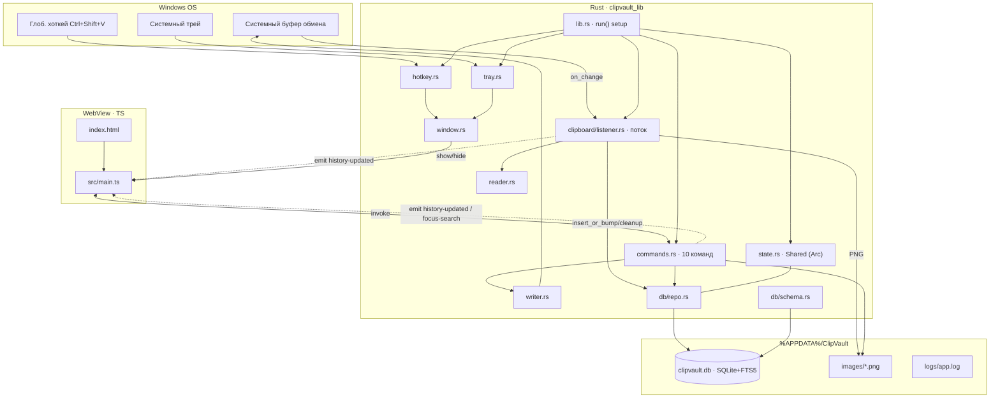

# 🗺️ PROJECT MAP — ClipVault

> **Карта проекта для навигации.** Ссылаться в начале каждого запроса.
> Проект: менеджер истории буфера обмена для Windows 10/11 x64.
> Стек: **Rust + Tauri 2** (бэкенд) · **TypeScript + Vite** (фронтенд) · **SQLite + FTS5** (хранилище).
> Версия: **1.2.0** · Путь: `D:\GitHub\buffer_pc\buffer_pc` · Git: **не репозиторий**.

---

## 1. Что это делает (одним абзацем)

Фоновая утилита (живёт в трее, окно скрыто). Нативно слушает буфер обмена без polling,
захватывает **текст / изображения / файлы**, дедуплицирует по SHA-256 и хранит локально в
`%APPDATA%\ClipVault\`. По `Ctrl+Shift+V` всплывает окно истории с мгновенным поиском (FTS5),
вкладками, закреплением, превью картинок. Выбор элемента кладёт его обратно в буфер.

---

## 2. Дерево (значимые файлы)

```
buffer_pc/
├── index.html                 UI окна истории (topbar+⚙, tabs, list, ctxmenu, confirm, lightbox, colorbox)
├── settings.html              UI окна настроек (лицензия, Pro, обновления, поддержка)
├── package.json               npm-скрипты, deps (@tauri-apps/api + plugin-updater/process/opener)
├── vite.config.ts             Vite: порт 1420, игнор src-tauri, 2 страницы (main + settings)
├── tsconfig.json              strict, ES2020, noUnusedLocals
├── docs/                      ── САЙТ-ЛЕНДИНГ (GitHub Pages, main /docs) ──
│   ├── index.html             одностраничник: герой + макет окна на CSS, возможности, приватность, Free/Pro, FAQ
│   ├── styles.css             та же «Graphite instrument», токены OKLCH, светлая/тёмная + ручной тумблер
│   ├── release.json           версия/размер/ссылка на установщик (переписывает publish-update.mjs)
│   └── .nojekyll, favicon.ico, icon.png
├── src/                       ── ФРОНТЕНД ──
│   ├── main.ts                ★ окно истории: refresh/render/действия/цвета/URL/метки/слоты/блокировка/фасеты
│   ├── settings.ts            окно настроек: лицензия/общие/данные/Pro/безопасность/обновления
│   ├── color.ts               распознавание/конвертация цветов (HEX/RGB/HSL) — Pro
│   ├── url.ts                 распознавание URL, чистка UTM, домен — Pro
│   ├── styles.css             дизайн-система «Graphite instrument» окна истории (токены OKLCH, .ico SVG, оверлеи, слоты, блокировка)
│   ├── settings.css           та же система для окна настроек (вордмарк-шапка, моно-микролейблы)
│   └── vite-env.d.ts
└── src-tauri/                 ── БЭКЕНД (Rust) ──
    ├── Cargo.toml             crate `clipvault` / lib `clipvault_lib`, deps, release-профиль
    ├── tauri.conf.json        окно 700×650, hidden/skipTaskbar/alwaysOnTop, NSIS-бандл
    ├── build.rs               tauri_build
    ├── capabilities/default.json   разрешения (window/event/shortcut/autostart/updater/process/opener)
    ├── examples/              genkey.rs (owner-CLI генератор Pro-ключей) + диагностика БД: dump/ftscheck/ftsdiag
    └── src/
        ├── main.rs            тонкая обёртка → clipvault_lib::run()
        ├── lib.rs             ★ ТОЧКА ВХОДА: плагины(+updater/process/opener), setup, окно-события, invoke_handler
        ├── state.rs           Shared: db, paused, last_written_hash, images_dir, is_pro, license_email, settings
        ├── paths.rs           каталоги данных (%APPDATA%\ClipVault или <exe>\data в portable) + settings.json + license.key
        ├── models.rs          ClipItem, NewItem, KIND_TEXT/IMAGE/FILES, now_ms()
        ├── settings.rs        Settings (auto_update/hotkey/ignore/font/окно/автоочистка/пароль/слоты) — JSON persist
        ├── license.rs         ★ офлайн-лицензия Ed25519: verify/activate/deactivate; публ. ключ зашит; DPAPI «в покое»
        ├── crypto.rs          DPAPI (protect/unprotect) + хеш мастер-пароля (соль+SHA-256)
        ├── source.rs          приложение-источник (GetForegroundWindow, windows-sys)
        ├── commands.rs        ★ ~39 команд для фронтенда (#[tauri::command])
        ├── tray.rs            меню трея: Открыть/⚙Настройки/Автозапуск/Пауза/Очистить/Выход
        ├── hotkey.rs          глоб. хоткей вызова (настраиваемый) + Alt+1..9 быстрая вставка (Pro)
        ├── window.rs          create_main + show/toggle/hide "main" + show_settings (лениво создаёт "settings"); профиль WebView2 в portable
        ├── clipboard/
        │   ├── mod.rs
        │   ├── listener.rs    ★ поток-слушатель: capture→dedup→БД/PNG→emit; лимит 1000
        │   ├── reader.rs      read_clipboard(): текст→файлы→картинка; sha_hex()
        │   └── writer.rs      write_text/write_image/write_files (обратно в буфер)
        └── db/
            ├── mod.rs         open(): Connection + schema::init
            ├── schema.rs      DDL: clipboard_items + clipboard_fts (FTS5) + триггеры; user_version=1
            └── repo.rs        ★ SQL-операции: insert_or_bump, list, search, cleanup, clear …
```

★ = основные файлы, куда чаще всего вносятся правки.

---

## 3. Граф архитектуры



---

## 4. Потоки данных (два ключевых сценария)

**A. Захват (копирование пользователем чего-либо):**
```
буфер меняется → listener.on_clipboard_change → handle()
  ├─ paused? → выход
  ├─ read_clipboard() → Captured{Text|Image|Files|None} + hash (sha_hex с префиксом t:/i:/f:)
  ├─ hash == last_written_hash? → это наша же запись → пропустить (anti-loop)
  ├─ build_item() (для картинки: RGBA→PNG в images/<hash>.png)
  ├─ repo::insert_or_bump() — если hash есть: use_count++ & last_used_at=now; иначе INSERT
  ├─ repo::cleanup(1000) — удалить старейшие НЕзакреплённые сверх лимита (+ их PNG)
  └─ emit("history-updated") → фронт делает refresh()
```

**B. Возврат в буфер (пользователь выбрал элемент):**
```
клик/Enter в UI → choose() → invoke("copy_item", {id})
  ├─ repo::get_by_id
  ├─ вычислить hash → сохранить в last_written_hash (чтобы listener не задублировал)
  ├─ writer::write_text | write_image | write_files
  ├─ repo::touch(id) (last_used_at, use_count++)
  ├─ emit("history-updated")
  └─ фронт: win.hide()
```

---

## 5. База данных

**Таблица `clipboard_items`** (schema.rs, `user_version = 3`):
`id, type(text|image|files), content, image_path, preview, mime_type, size,
created_at, last_used_at, use_count, is_pinned, content_hash(UNIQUE),
source_app(v2), category(v3), tags(v3)`
Индекс: `idx_items_order(is_pinned DESC, last_used_at DESC)`.
Миграции: v2 добавляет `source_app`; v3 — `category`,`tags` (ALTER ADD COLUMN).

**FTS5 `clipboard_fts`** — external-content по `content`, tokenize `unicode61 remove_diacritics 2`
(кириллица + префиксный поиск). Синхронизируется триггерами AI/AD/AU.
Поиск: `to_fts_query()` оборачивает термы в `"…"*` (префиксный, экранирование кавычек).

**Инварианты:**
- Дедуп по `content_hash` — повтор поднимает запись, не создаёт новую.
- Закреплённые (`is_pinned=1`) НЕ удаляются автоочисткой и `clear(keep_pinned=true)`.
- PRAGMA: WAL, synchronous=NORMAL, busy_timeout=3000, foreign_keys=ON.

---

## 6. Команды (invoke) — мост TS ↔ Rust

| Команда (`commands.rs`) | Аргументы | Возврат | Назначение |
|---|---|---|---|
| `list_items` | filter, limit, offset | `ClipItem[]` | список по вкладке (all/pinned/text/image/files) |
| `search_items` | query, limit | `ClipItem[]` | FTS5-поиск |
| `copy_item` | id | — | вернуть элемент в буфер |
| `set_pinned` | id, pinned | — | закрепить/открепить |
| `delete_item` | id | — | удалить (+ PNG) |
| `clear_history` | keepPinned | — | очистить историю |
| `toggle_pause` | — | bool | пауза записи вкл/выкл |
| `get_pause` | — | bool | текущее состояние паузы |
| `item_image_data_url` | id | `string?` | PNG как data-URL (base64) для webview |
| `hide_window` | — | — | спрятать окно |
| `open_settings` | — | — | открыть (лениво создать) окно настроек |
| `get_license` | — | `LicenseInfo` | статус лицензии {pro, email} |
| `activate_license` | key | `LicenseInfo` | проверить подпись Ed25519 → сохранить → снять гейт |
| `deactivate_license` | — | — | удалить ключ, вернуть Free |
| `export_license` | — | `string?` | сырой сохранённый ключ (для экспорта) |
| `get_settings` | — | `Settings` | {auto_update} |
| `set_auto_update` | enabled | — | тумблер авто-обновлений («режим паранойи») |

**События (emit → listen):** `history-updated`, `focus-search`, `pause-changed`, `license-changed` (Pro активирован/снят).

---

## 7. Состояние и потоки

- **`Shared`** (state.rs) один экземпляр в `app.manage()` и в потоке-слушателе; все поля за `Arc`:
  `db: Arc<Mutex<Connection>>`, `paused: Arc<AtomicBool>`, `last_written_hash: Arc<Mutex<Option<String>>>`, `images_dir`.
- **Потоки:** главный (Tauri/UI) + отдельный поток `clipboard-master` (`listener::spawn`).
- **Плагины (порядок важен):** `single-instance` (первым) → `global-shortcut` → `autostart`.
- **Поведение окна:** крестик → `hide` + `prevent_close`; в релизе потеря фокуса → `hide`.
- **Автозапуск:** включается один раз при первом старте (маркер `.initialized`), далее — выбор юзера.

---

## 8. Данные и сборка

- **Данные:** `%APPDATA%\ClipVault\` (`dirs::data_dir` = Roaming) → `clipvault.db`, `images/`, `logs/app.log`.
  ⚠️ Roaming намеренно (а не Local), чтобы установщик currentUser не снёс историю. **Но** examples/ читают `data_local_dir()` — рассинхрон, учесть при диагностике.
- **Dev:** `npm install` → `npm run tauri dev`.
- **Release:** `npm run tauri build` → `src-tauri/target/release/clipvault.exe` + NSIS в `bundle/`.
- **Диагностика БД:** `cargo run --example dump | ftscheck -- <term> | ftsdiag` (из `src-tauri/`).
- **Сайт:** `docs/` → GitHub Pages (`main` / `/docs`), `https://wufcorp.github.io/ClipVault/`.
  Локально — `npx vite docs`. Версию на сайте обновляет `npm run publish-update` (пишет `docs/release.json`),
  дальше нужен коммит и пуш `docs/`. См. [RELEASE.md](RELEASE.md) §6.7.

---

## 9. Границы «реализовано / дальше»

**Есть:** захват text/image/files, дедуп, FTS5, хоткей, трей, пауза, закрепление, автозапуск, single-instance, NSIS.
**Монетизация (реализовано, все фазы):** экран настроек · авто-обновление S3 (updater/process) · внешние ссылки (opener) · офлайн-лицензия Ed25519 + Pro-гейт (`Shared::is_pro`) · лимит **Free=200 / Pro=10 000** · захват источника + игнор-приложения · экспорт TXT/JSON + импорт · смена хоткея вызова · Pro: цвета, plain-text, URL/UTM, память окна+шрифт+компакт, автоочистка по возрасту, фасеты (источник/дата/тег/regex), метки/теги, умные коллекции (цвета/ссылки), картинки (сохранить/путь), слоты, быстрая вставка Alt+1..9, мастер-пароль+автоблок · DPAPI-защита секретов.
**Осталось (ручное, Фаза 6):** сборка/подпись, latest.json → S3, сквозной тест обновления, каналы (Store/WinGet/GitHub), запуск. См. [RELEASE.md](RELEASE.md).
**Не реализовано осознанно:** полное шифрование БД (конфликт с FTS5; нужен SQLCipher) — 5.1 сделано как DPAPI-защита ключа/пароля.

---

## 10. Куда смотреть при типовой задаче

| Задача | Файлы |
|---|---|
| Новый тип контента | `reader.rs` (Captured) → `listener.rs` (build_item) → `writer.rs` → `models.rs` (KIND_*) → `index.html`+`main.ts` (вкладка/иконка) |
| Новая команда/API | `commands.rs` + `lib.rs` (invoke_handler) + `main.ts` (invoke) |
| Изменить схему БД | `schema.rs` (миграция, поднять SCHEMA_VERSION) + `repo.rs` + `models.rs` |
| Логика поиска | `repo.rs` (to_fts_query/search) + `schema.rs` (FTS) |
| UI / стили / вкладки | `index.html` + `src/main.ts` + `src/styles.css` |
| Трей / хоткей / окно | `tray.rs` / `hotkey.rs` / `window.rs` |
| Лимит истории / автоочистка | `listener.rs` (FREE_MAX_ITEMS/PRO_MAX_ITEMS + is_pro()) + `repo.rs` (cleanup) |
| Пути данных / логи | `paths.rs` + `lib.rs` (init_logging) |
| Лицензия / Pro-гейт | `license.rs` (verify) + `state.rs` (is_pro) + `commands.rs` + `settings.ts` |
| Настройки / обновления | `settings.rs` + `settings.html`/`settings.ts` + `tauri.conf.json` (plugins.updater) |
| Цвета (Pro) | `src/color.ts` + `main.ts` (swatch, colorbox) |
| Установщик | `tauri.conf.json` (bundle.windows.nsis) |
| Сайт-лендинг | `docs/index.html` + `docs/styles.css`; версия и ссылка — `docs/release.json` |
```
